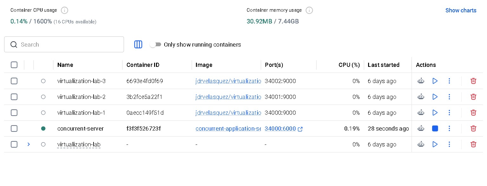
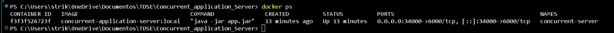
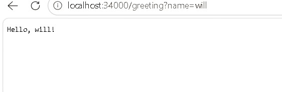

# Concurrent Application Server

Este es el repositorio 2 del taller de virtualización. No usa Spring. El proyecto tiene un framework web pequeño llamado `MiniHttpServer`.

## Estado actual

- El framework registra rutas GET con `get(path, handler)`.
- Atiende varias solicitudes al mismo tiempo con Java 21.
- Expone `GET /greeting?name=<nombre>`.
- Lee el puerto desde la variable de entorno `PORT`, si no existe usa el puerto `6000`.
- Cuando recibe `SIGTERM` o `Ctrl+C`, espera hasta 10 segundos para terminar las solicitudes en curso y luego cierra el servidor.
- Se puede ejecutar en Docker con Amazon Corretto 21.

## Requisitos

- Java 21
- Maven 3.9+
- Docker Desktop (para la ejecución en contenedor)

## Construir y ejecutar localmente

```powershell
mvn clean package
$env:PORT=6000
java -jar target/concurrent-application-server-1.0.0.jar
```

En otra terminal:

```powershell
curl "http://localhost:6000/greeting?name=Pedro"
```

Respuesta esperada: `Hello, Pedro!`.

Para usar otro puerto:

```powershell
$env:PORT=8080
java -jar target/concurrent-application-server-1.0.0.jar
```

## Docker

```powershell
docker build -t <dockerhub-user>/concurrent-application-server:1.0 .
docker run -d --name concurrent-server -e PORT=6000 -p 34000:6000 <dockerhub-user>/concurrent-application-server:1.0
curl "http://localhost:34000/greeting?name=Container"
```

Para detener el contenedor, Docker envía `SIGTERM`. El servidor deja terminar las solicitudes que estén activas.

```powershell
docker stop concurrent-server
docker logs concurrent-server
```

## Evidencia local

El contenedor se ejecuta en Docker Desktop.



El comando `docker ps` muestra el contenedor y el puerto publicado.



La aplicación responde desde el navegador.



## Despliegue en EC2

En una instancia Amazon Linux 2023 con Docker instalado:

```bash
docker pull <dockerhub-user>/concurrent-application-server:1.0
docker run -d --name concurrent-server --restart unless-stopped \
  -e PORT=6000 -p 8080:6000 \
  <dockerhub-user>/concurrent-application-server:1.0
```

Abra el puerto `8080` en el security group únicamente para la red necesaria y compruebe:

```text
http://<ec2-public-dns>:8080/greeting?name=AWS
```

## Evidencia de progreso

El commit `ddf4e88` agrega concurrencia, `PORT`, apagado ordenado y Docker. Cuando el repositorio esté en GitHub, agregue aquí el enlace al commit y las capturas de Docker y EC2.
